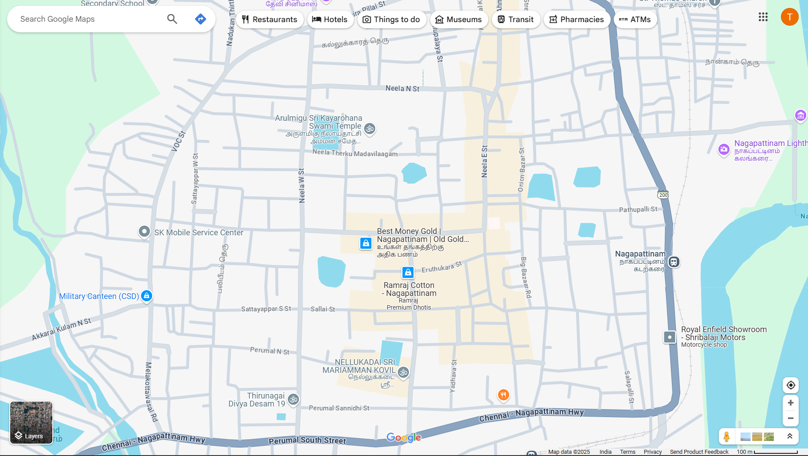

# Ex04 Places Around Me
## Date: 16.04.2025

## AIM
To develop a website to display details about the places around my house.

## DESIGN STEPS

### STEP 1
Create a Django admin interface.

### STEP 2
Download your city map from Google.

### STEP 3
Using ```<map>``` tag name the map.

### STEP 4
Create clickable regions in the image using ```<area>``` tag.

### STEP 5
Write HTML programs for all the regions identified.

### STEP 6
Execute the programs and publish them.

## CODE
```
map.html
<html>
<head>
<title>
image map
</title>
<body>
    <!-- Image Map Generated by http://www.image-map.net/ -->


<map name="image-map">
    <area target="" alt="Beach" title="Beach" href="nagapattinam beach.html" coords="1381,557,1542,644" shape="rect">
    <area target="" alt="showroom" title="showroom" href="royal enfield.html" coords="1471,734,1549,727,1558,796,1475,805" shape="poly">
    <area target="" alt="temple" title="temple" href="kayarohana.html" coords="751,320,106" shape="circle">
</map>
</body>
</head>
</html>
```
```
kayarohana.html
<!DOCTYPE html>
<html>
<head>
    <title>NAGAPATTINAM</title>
    <style>
        body {
            background-color: cyan;
        }
        dt {
            text-align: center;
            font-weight: bold;
        }
    </style>
</head>
<body>
    <dl>
        <dt>kayarohana</dt>
        <dd>
            It is one of the oldest temples in Nagapattinam.
        </dd>
    </dl>
</body>
</html>
```
```
nagapattinam beach.html
<!DOCTYPE html>
<html>
<head>
    <title>NAGAPATTINAM</title>
    <style>
        body {
            background-color: cyan;
        }
        dt {
            text-align: center;
            font-weight: bold;
        }
    </style>
</head>
<body>
    <dl>
        <dt>nagapattinam beach</dt>
        <dd>
            Nagapattinam Beach is a popular spot for visitors looking for a relaxing day by the sea, offering activities like swimming, sunbathing, and evening walks.
        </dd>
    </dl>
</body>
</html>
```
```
royal enfield.html

<!DOCTYPE html>
<html>
<head>
    <title>NAGAPATTINAM</title>
    <style>
        body {
            background-color: cyan;
        }
        dt {
            text-align: center;
            font-weight: bold;
        }
    </style>
</head>
<body>
    <dl>
        <dt>royal enfield</dt>
        <dd>
            ROYAL ENFIELD SHOWROOM
        </dd>
    </dl>
</body>
</html>
```

## OUTPUT




## RESULT
The program for implementing image maps using HTML is executed successfully.
